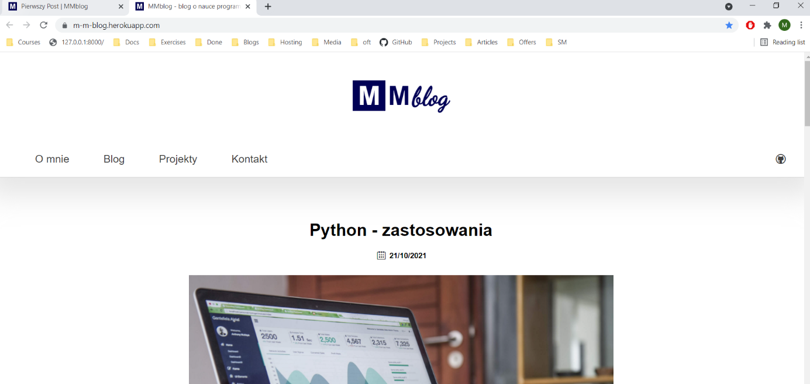
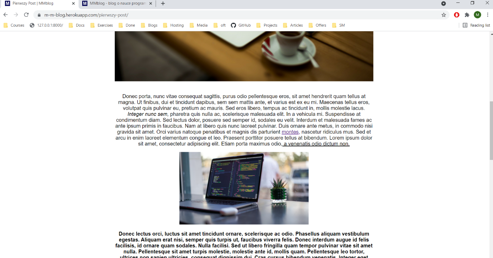
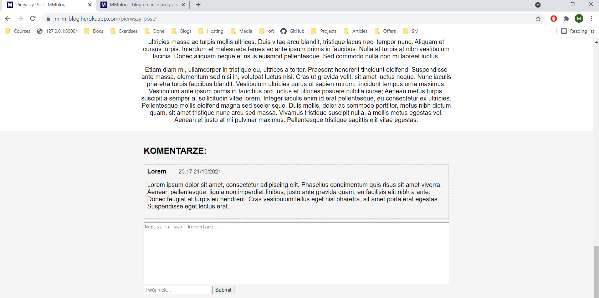
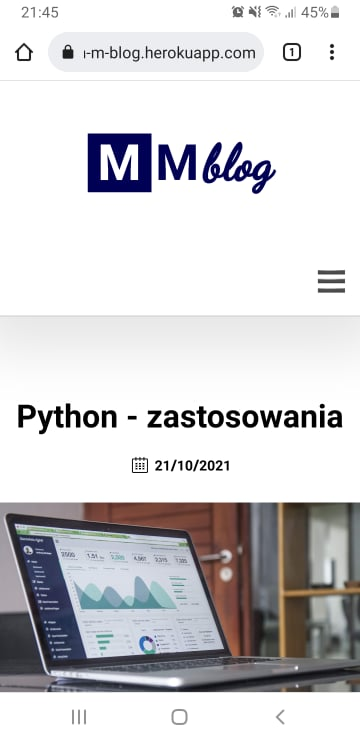

# MMblog - blog about programming

## Table of contents
* [General info](#general-info)
* [Technologies](#technologies)
* [Features](#features)
* [Setup](#setup)
* [Inspiration](#inspiration)

## General info

Simple blog app created with Django. My main focus was to gain basic skills in web development with this framework, HTML and CSS. This is my first web app created only by me.

## Technologies

 - Python 
 - Django 
 - PostgreSQL
 - AWS S3
 - Heroku
 - Django ckeditor 6
 - HTML
 - CSS

Database is currently hosted on Heroku. At first I used AWS RDS but unfortunately my free trial expired.
 

## Features

 - CRUD of posts using admin panel
 - Adding comments by readers
 - Hamburger menu in html&css
 - Pagination
 
## Setup 

## Inspiration

Some parts of code are inspired from:
 - Book: Django 2 by Example by Antonio Mele 
 - Tutorial: https://www.youtube.com/watch?v=xv_bwpA_aEA&list=PL-51WBLyFTg2vW-_6XBoUpE7vpmoR3ztO&index=1&ab_channel=DennisIvy
